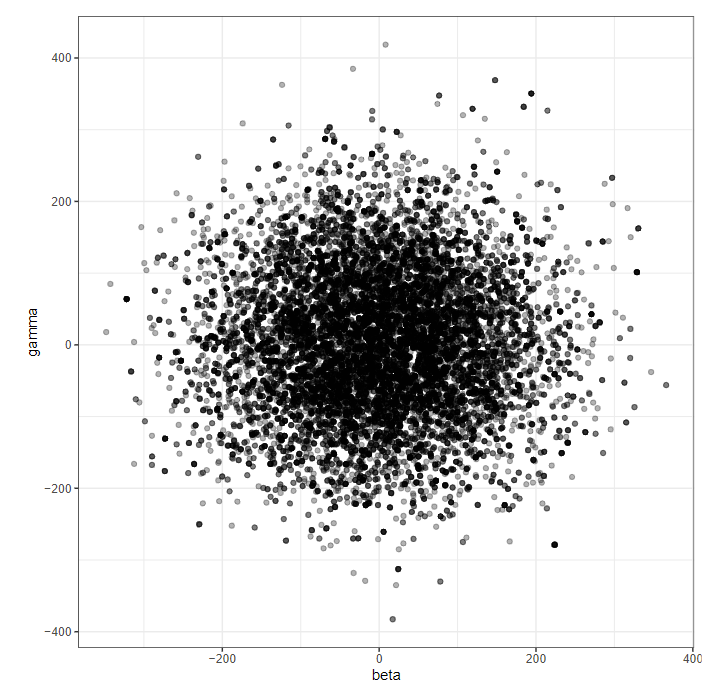

# Epidemic Modeling with SIR model

    

**Description:**

1. In this project, we discover the use of the SIR model (and its variants) to model affects of pandemic on a population.
2. Then, using mathematical methods, we can estimate/calculate how the population changes over time.
3. After that, we push further by allowing the model's parameters to change randomly over time and observe the effect
4. Finally, we put them all together on VietNam's covid dataset to calculate the parameters and estimate the effect of social distancing on the pandemic.

Detailed report could be found [here](https://www.overleaf.com/read/mgzctpthrwbx)

## Details

1. SIR model and their variants
    |SIR| SIS| SIRD| SEIRD|
    |-|-|-|-|
    |||||
2. Euler's solution to SIR

    
3. Random sampling of SIR model's parameters (beta and gamma)

    
4. Change of covid's reproductive value (R_0 - aka infectiousness) before and after social distancing

    

## Acknowledgements

- All references are included in the reference folder
